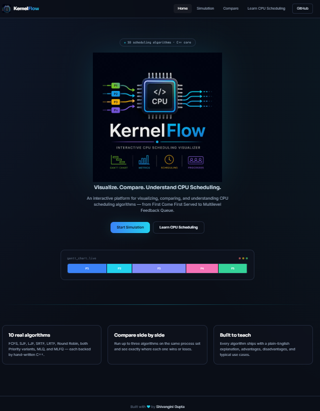
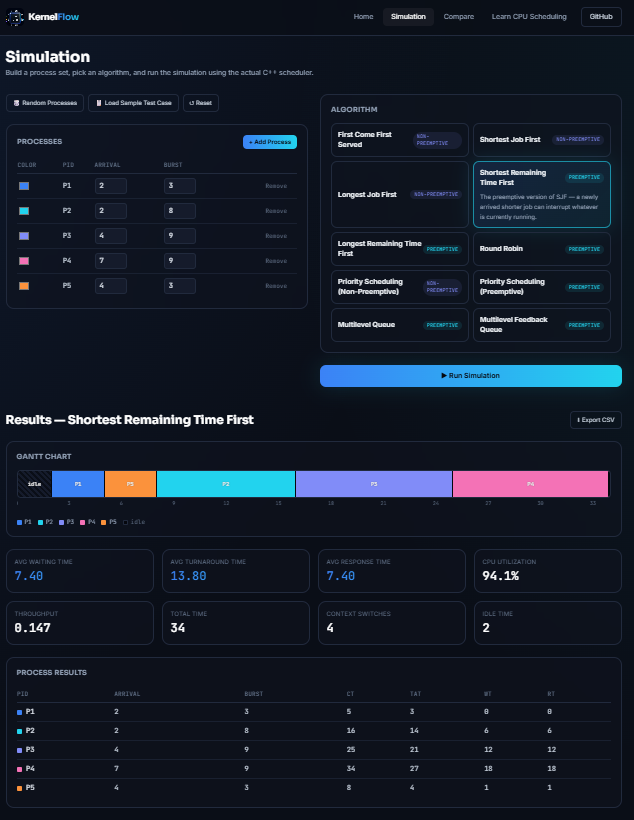
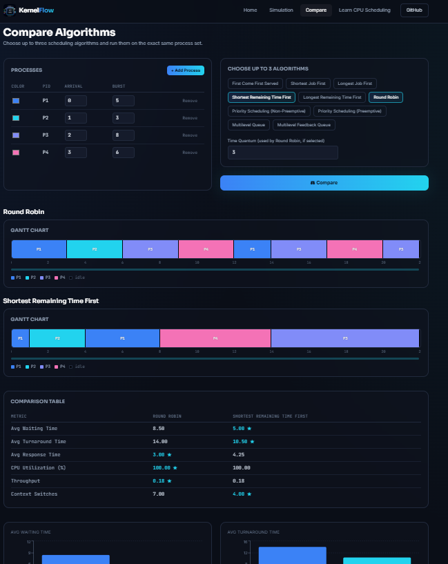
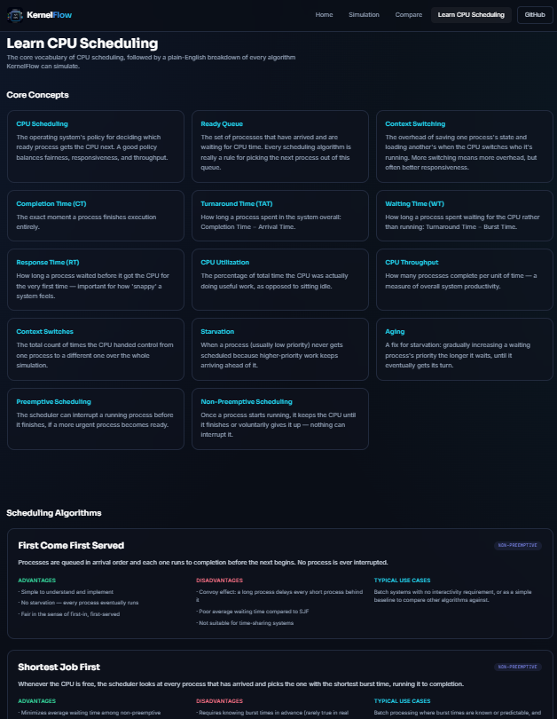

<div align="center">


# KernelFlow

**Visualize. Compare. Understand CPU Scheduling.**

An interactive platform for visualizing, comparing, and understanding CPU scheduling
algorithms — built with a React + TypeScript frontend, a FastAPI backend, and
10 hand-written C++ scheduling algorithms at its core.

[](#)
[](#)
[](#)
[](#)
[](#)

</div>

---

## Overview

KernelFlow lets you build a set of processes, run any of **10 classic CPU
scheduling algorithms** against them, and instantly see an animated Gantt
chart, per-process metrics (completion/turnaround/waiting/response time),
and system-level stats (CPU utilization, throughput, context switches). You
can also compare up to three algorithms side by side on the exact same
process set, and read a full, beginner-friendly explanation of every
algorithm on the Learn page.

Every scheduling decision is computed by real C++ — nothing is simulated or
faked in JavaScript or Python. The backend exists purely to validate
requests and hand them off to compiled C++ programs.

## Screenshots

<table>
<tr>
<td width="50%">

**Landing Page**


</td>
<td width="50%">

**Simulation Page**


</td>
</tr>
<tr>
<td width="50%">

**Compare Algorithms**


</td>
<td width="50%">

**Learn CPU Scheduling**


</td>
</tr>
</table>

## Features

- 🧮 **10 scheduling algorithms** — FCFS, SJF, LJF, SRTF, LRTF, Round Robin,
  Priority (Preemptive & Non-Preemptive), MLQ, and MLFQ
- 📊 **Animated Gantt charts** with per-process color coding
- 📈 **Full metrics** — completion, turnaround, waiting, and response time
  per process; CPU utilization, throughput, context switches, and idle time
  overall
- ⚖️ **Compare mode** — run up to 3 algorithms on the same process set and
  see the best-performing one per metric, with bar charts
- 📚 **Learn page** — plain-English explanations, advantages,
  disadvantages, and use cases for every algorithm
- 🎲 Random process generator, sample test cases, and CSV export
- 🎨 Modern dark UI with glassmorphism and smooth animations

## Tech Stack

| Layer | Technology |
|---|---|
| **Frontend** | React 18, TypeScript, Vite, Tailwind CSS, Framer Motion, Recharts |
| **Backend** | FastAPI, Pydantic, Uvicorn |
| **Scheduling Engine** | C++17 (10 hand-written algorithm implementations) |
| **Bridge Layer** | Custom JSON-over-stdin/stdout C++ programs, invoked by FastAPI via `subprocess` |

No database — the app is completely stateless. Every simulation is computed
fresh from whatever you enter.

## Architecture

```
React (Vite)  ──POST /simulate/<algo>──▶  FastAPI  ──subprocess + JSON──▶  Compiled C++ bridge  ──▶  Your C++ algorithm
```

FastAPI never computes a schedule itself — it validates the request with
Pydantic, invokes the matching compiled C++ program in `backend/bin/`,
and forwards that program's JSON output straight back to React. See
`backend/main.py` — it's written to be a beginner-friendly, heavily
commented walkthrough of exactly how FastAPI and C++ talk to each other.

## Project Structure

```
kernelflow/
├── backend/
│   ├── cpp/                # Original C++ scheduling algorithms
│   ├── cpp_bridges/         # JSON-in/JSON-out wrappers around each algorithm
│   ├── bin/                 # Compiled executables (generated, not committed)
│   ├── main.py               # FastAPI app — one endpoint per algorithm
│   ├── build.sh               # Compiles all C++ bridges
│   └── requirements.txt
├── frontend/
│   ├── src/
│   │   ├── pages/            # Landing, Simulation, Compare, Learn
│   │   ├── components/        # Navbar, ProcessTable, GanttChart, etc.
│   │   ├── data/              # Algorithm metadata & Learn page content
│   │   └── lib/api.ts          # API client
│   └── public/                # Logo assets
└── screenshots/
```

## Getting Started

### Prerequisites
- A C++17 compiler (`g++` or `clang++`)
- Python 3.9+
- Node.js 18+

### 1. Clone the repo

```bash
git clone https://github.com/Shivangini-coder/KernelFlow.git
cd kernelflow
```

### 2. Run the backend

```bash
cd backend
python3 -m venv venv
source venv/bin/activate        # Windows: venv\Scripts\activate

pip install -r requirements.txt

bash build.sh                    # compiles the 10 C++ bridges into backend/bin/
                                  # Windows without Git Bash: run each g++ line
                                  # from build.sh manually, or install Git Bash

python main.py                   # starts the API on http://localhost:8002
```

Visit **http://localhost:8002/docs** to explore the API interactively.

### 3. Run the frontend

In a new terminal:

```bash
cd frontend
npm install
cp .env.example .env             # set VITE_API_BASE_URL if you changed the backend port
npm run dev
```

Visit **http://localhost:5173**.

> 💡 If you change the backend's port, update the `PORT` constant in
> `backend/main.py` **and** `VITE_API_BASE_URL` in `frontend/.env` to match.

## API Reference

All endpoints are `POST` requests that accept a list of `processes` and
return a `SimulationResult` (Gantt chart, per-process results, and summary
metrics).

| Endpoint | Extra fields required |
|---|---|
| `POST /simulate/fcfs` | — |
| `POST /simulate/sjf` | — |
| `POST /simulate/ljf` | — |
| `POST /simulate/srtf` | — |
| `POST /simulate/lrtf` | — |
| `POST /simulate/round-robin` | `timeQuantum` |
| `POST /simulate/priority-non-preemptive` | `priority` per process |
| `POST /simulate/priority-preemptive` | `priority` per process |
| `POST /simulate/mlq` | `queueIndex` per process, `queues[]` |
| `POST /simulate/mlfq` | `queues[]`, `agingThreshold` |

Full interactive docs at `/docs` once the backend is running.

## Roadmap / Ideas

- [ ] PDF export of results
- [ ] Preset test-case library
- [ ] Deployable live demo

## Contact

**Shivangini Gupta**

- 💼 LinkedIn — [linkedin.com/in/shivangini-gupta-igdtuw](https://www.linkedin.com/in/shivangini-gupta-igdtuw/)
- 🐙 GitHub — [github.com/Shivangini-coder](https://github.com/Shivangini-coder)
- 📧 Email — [shivangini2006@gmail.com](mailto:shivangini2006@gmail.com)

---

<div align="center">

Built with ❤️ by **Shivangini Gupta**

</div>
